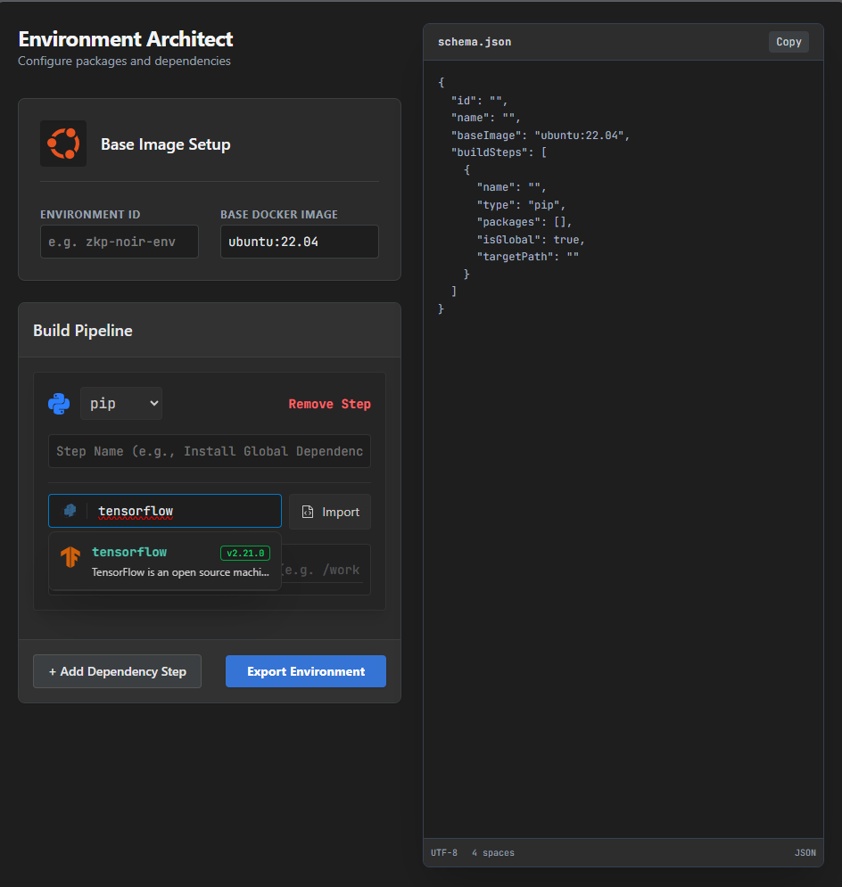

# 🖥️ Frontend Environment Manager

The Frontend Environment Manager is the visual orchestrator of the Cloud IDE's Infrastructure as Code (IaC) experience. It provides a highly decoupled, modular interface that allows developers to define, edit, and visualize linear build pipelines before they are compiled into JSON manifests and dispatched to the backend.

## 📸 The Environment Architect

The primary interface provides a synchronized, split-view experience. As developers construct their pipeline visually on the left, the resulting IaC payload is generated in real-time on the right.

*(Above: The Environment Architect interface demonstrating the Base Image Setup, the visual Build Pipeline for a TensorFlow installation via `pip`, and the synchronized `schema.json` output.)*

---

## 🏗️ Architectural Philosophy

The module strictly adheres to a **separation of concerns**, completely decoupling UI rendering from state management. 
* **Barrel File Pattern:** Components, hooks, and widgets are cleanly exported, ensuring tidy imports and encapsulation across the broader IDE frontend.
* **Hook-Driven State:** Complex form logic, schema compilation, and file parsing are entirely abstracted into custom React hooks, keeping the React components lightweight, declarative, and focused solely on rendering.

---

## 🧩 Core Components

### `EnvManager.tsx`
The root orchestrator of the module. It manages the top-level layout, provides context to child components, and acts as the ultimate bridge between the local environment state and the global IDE state.

### `BuildPipeline.tsx`
The primary visual container for the environment construction. It renders the sequential array of build steps, handling the visual ordering, drag-and-drop mechanics, and the injection of new steps into the active pipeline.

### `BuildStepCard.tsx`
The atomic editor for individual steps. Depending on the step type (e.g., `system_package`, `runtime`), this card adapts its input fields, providing contextual validation and syntax highlighting for the specific commands being written.

### `DependencyManager.tsx`
A specialized module dedicated to handling bulk package imports and list management. It efficiently parses incoming package lists and translates them into actionable build steps within the pipeline.

### 🧰 Micro-Widgets
* **`JsonPreviewWidget.tsx`:** Provides a real-time, syntax-highlighted preview of the generated JSON schema as the user interacts with the UI, ensuring complete transparency of the underlying IaC payload.
* **`PackageSearchWidget.tsx`:** An interactive search component designed to help developers quickly find, select, and validate system or runtime packages before adding them to a step.

---

## 🧠 State & Logic Management

Business logic is strictly isolated into custom hooks to ensure maximum testability and reusability without polluting the DOM elements:

* **`useEnvManager`:** Manages the overarching schema state, handles the final compilation of the JSON payload, and enforces client-side operational guardrails (such as `MAX_STEPS` and timeout limits).
* **`useBuildPipeline`:** Handles the internal array mutations—managing the insertion, deletion, and reordering of `BuildStep` objects within the visual pipeline.
* **`useDependencyActions`:** Encapsulates the complex logic for parsing files, deduplicating package lists, and resolving potential dependency conflicts before they hit the UI.

---

## 🎨 UI/UX Design System

The environment manager is styled to feel like a native, premium desktop application, ensuring deep visual consistency with the rest of the IDE:
* **Typography:** Utilizes **JetBrains Mono** for all code blocks, paths, and terminal commands to ensure perfect readability, character alignment, and a native developer feel.
* **Color Palette:** Built entirely on a **Darcula-inspired dark theme**, prioritizing low eye strain during long development sessions, with precise contrast ratios for active inputs, focused states, and validation errors.

---

## 🔄 Integration Lifecycle
1. **Interaction:** The developer visually constructs the environment using the `BuildStepCard` and `DependencyManager`.
2. **Preview:** The `JsonPreviewWidget` reflects the underlying data structure in real-time.
3. **Compilation:** The `useEnvManager` hook compiles the visual state into the strict, linear JSON array format.
4. **Execution:** The validated JSON payload is handed off to the backend `StageOrchestrator` to begin the physical Docker container generation.

## Current TODOs Here:
[x] Basic Environment Manager UI
[ ] Setup the backend database proxy (check backend/server.ts)
[ ] Setup the section to proxy saved environment from backend database

# Should eventually look like this:

