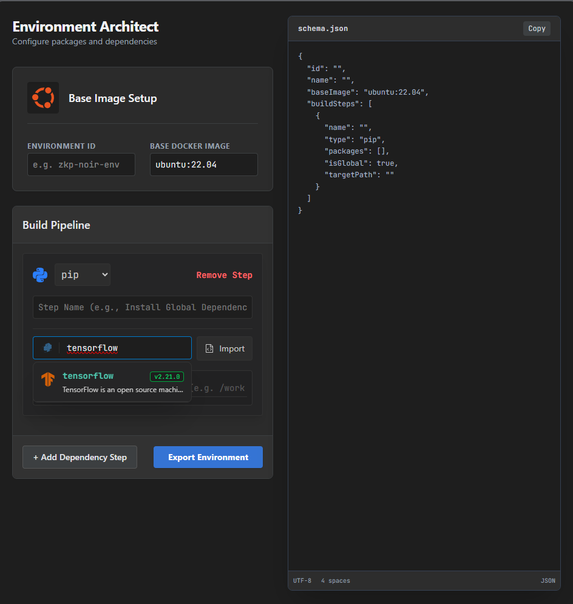

# 🖥️ Frontend Environment Manager

The Frontend Environment Manager is the visual orchestrator of the Cloud IDE's Infrastructure as Code (IaC) experience. It provides a highly decoupled, modular interface that allows developers to define, edit, and visualize linear build pipelines before they are compiled into JSON manifests and dispatched to the backend.

## 📸 The Environment Architect

The primary interface provides a synchronized, split-view experience. As developers construct their pipeline visually on the left, the resulting IaC payload is generated in real-time on the right.



*(Above: The Environment Architect interface demonstrating the Base Image Setup, the visual Build Pipeline for a TensorFlow installation via `pip`, and the synchronized `schema.json` output.)*

---

## 🏗️ Architectural Philosophy

The module strictly adheres to a **separation of concerns**, completely decoupling UI rendering from state management. 
* **Barrel File Pattern:** Components, hooks, and widgets are cleanly exported, ensuring tidy imports and encapsulation across the broader IDE frontend.
* **Hook-Driven State:** Complex form logic, schema compilation, and file parsing are entirely abstracted into custom React hooks, keeping the React components lightweight, declarative, and focused solely on rendering.

---

## 🧩 Core Components

### `EnvManager.tsx`
The root orchestrator of the module. It manages the top-level layout, provides context to child components, and acts as the ultimate bridge between the local environment state and the global IDE state.

### `BuildPipeline.tsx`
The primary visual container for the environment construction. It renders the sequential array of build steps, handling the visual ordering, drag-and-drop mechanics, and the injection of new steps into the active pipeline.

### `BuildStepCard.tsx`
The atomic editor for individual steps. Depending on the step type (e.g., `system_package`, `runtime`), this card adapts its input fields, providing contextual validation and syntax highlighting for the specific commands being written.

### `DependencyManager.tsx`
A specialized module dedicated to handling bulk package imports and list management. It efficiently parses incoming package lists and translates them into actionable build steps within the pipeline.

### 🧰 Micro-Widgets
* **`JsonPreviewWidget.tsx`:** Provides a real-time, syntax-highlighted preview of the generated JSON schema as the user interacts with the UI, ensuring complete transparency of the underlying IaC payload.
* **`PackageSearchWidget.tsx`:** An interactive search component designed to help developers quickly find, select, and validate system or runtime packages before adding them to a step.

---

## 🧠 State & Logic Management

Business logic is strictly isolated into custom hooks to ensure maximum testability and reusability without polluting the DOM elements:

* **`useEnvManager`:** Manages the overarching schema state, handles the final compilation of the JSON payload, and enforces client-side operational guardrails (such as `MAX_STEPS` and timeout limits).
* **`useBuildPipeline`:** Handles the internal array mutations—managing the insertion, deletion, and reordering of `BuildStep` objects within the visual pipeline.
* **`useDependencyActions`:** Encapsulates the complex logic for parsing files, deduplicating package lists, and resolving potential dependency conflicts before they hit the UI.

---

## 📦 Package Manager Registry (`registry/`)

Every package manager (npm, pip, apt, cargo, go, ruby, maven, gradle, zig, shell) is
described in **exactly one place**: a manifest keyed by `InstallStepType`.

```
registry/
  types.ts          # PackageManager + PackageSearchResult
  index.ts          # MANAGERS: Record<InstallStepType, PackageManager> + searchRegistry() / parseFile() / acceptExtsFor()
  managers/*.ts     # one file per manager: { label, icon, color, search, parse?, canParse?, acceptExts? }
  EnvIcon.tsx       # <EnvIcon type=... /> — manifest icon via @iconify/react (cached SVG)
```

Each `managers/<type>.ts` owns that manager's **registry search**, **file parser**, and
**icon** together. The rest of the module never switches on type — it reads the manifest:
`searchRegistry(query, type)`, `parseFile(file, type)`, `acceptExtsFor(type)`, `<EnvIcon type=.../>`.

**Adding a package manager** = create `managers/<type>.ts` and add one line to `MANAGERS`
in `index.ts`. Because `MANAGERS` is a `Record<InstallStepType, …>`, a missing entry is a
compile error — the type list in `shared/types/env.ts` is the single source of truth.

Icons render through the shared Iconify pipeline (inline SVG, cached after first load) —
no per-render network requests.

---

## 🎨 UI/UX Design System

The environment manager is styled to feel like a native, premium desktop application, ensuring deep visual consistency with the rest of the IDE:
* **Typography:** Utilizes **JetBrains Mono** for all code blocks, paths, and terminal commands to ensure perfect readability, character alignment, and a native developer feel.
* **Color Palette:** Built entirely on a **Darcula-inspired dark theme**, prioritizing low eye strain during long development sessions, with precise contrast ratios for active inputs, focused states, and validation errors.

---

## 🔄 Integration Lifecycle
1. **Interaction:** The developer visually constructs the environment using the `BuildStepCard` and `DependencyManager`.
2. **Preview:** The `JsonPreviewWidget` reflects the underlying data structure in real-time.
3. **Compilation:** The `useEnvManager` hook compiles the visual state into the strict, linear JSON array format.
4. **Execution:** The validated JSON payload is handed off to the backend `StageOrchestrator` to begin the physical Docker container generation.


## Current TODOs Here:
 - [x] Basic Environment Manager UI
 - [x] Backend database proxy — `services/api/environmentApi.ts` proxies `/api/environment` (list/get, REST create `POST` / update `PUT /:id`, delete, build, status). Backend routes/repo mounted in `server.ts`.
 - [x] Section to proxy saved environments — `MyEnvironments.tsx` + `useEnvironments.ts` list saved envs, open one into the Architect, build, and delete (with toasts).
 - [x] Single source of naming validity — `@cloud-ide/shared/utils/naming.ts` (opaque id + display name + slug; RFC 1123 / OCI standards). Auto-names when blank.
 - [x] Pluggable build pipeline — `services/builder` (`IBuilder`/`BuilderRegistry`/`BuildService`), status + concurrency guard, persisted to `data/builds.json` with restart reconciliation.
 - [x] Live build-status badge — SSE push via `GET /api/environment/events` (`useBuildStatuses.ts`).
 - [x] Content-addressed image tags — `cloud-ide-<id>:<contentHash>` + `:latest`.

---

## Architecture & Decisions

Decision log for the naming + build pipeline. Each names the **why** and the **seam** it leaves for change.

1. **Identity ≠ label.** An environment has an opaque, immutable `id` (system-minted, RFC 1123), a free-form `name`, and a derived `slug`. *Why:* renaming can't change identity or re-tag images, and two envs can never collide (the id is the key, not the name). *Seam:* `shared/utils/naming.ts`.
2. **One source of naming validity.** All id/name/slug/tag rules live in `shared/utils/naming.ts`, imported by frontend **and** backend. Standards: RFC 1123 label (k8s/DNS) for ids/slugs, OCI/Docker reference grammar for tags. *Why:* the old mangling bug came from two code paths disagreeing.
3. **Auto-naming.** Blank name → generated `adjective-noun` (`resolveNewNaming`). *Why:* uniqueness rides on the id, so friendly names needn't be unique — we can safely name envs for the user.
4. **REST create/update split.** `POST` mints a new env; `PUT /:id` updates the open one. *Why:* upsert-by-name silently clobbered records.
5. **Pluggable builder.** `IBuilder` + `BuilderRegistry`; `DockerBuilder` is one impl. *Why:* swap Docker for BuildKit/Kaniko/remote without touching routes or the service. *Seam:* `services/builder`.
6. **Status/history behind `IBuildStore`.** `JsonBuildStore` persists to `data/builds.json`, reconciles builds interrupted by a restart (→ failed), and enforces a per-env **concurrency guard** (409). *Why:* durability + no double-builds; *seam:* swap the store for Redis/Postgres, `BuildService` unchanged.
7. **Content-addressed image tags.** Build tags `cloud-ide-<id>:<contentHash>` **and** `:latest`. The hash (`contentTag`, FNV-1a 64-bit over a canonical config projection — step order significant, package/env order not) is deterministic. *Why:* immutable per-build refs enable rollback (every history row keeps its tag) and cache identity. *Trade-off:* non-cryptographic hash — collision-negligible at realistic scale, upgrade to SHA-256 if needed.
8. **Live status via SSE push.** `BuildService` is an event bus; `GET /events` streams a `snapshot` on connect then a `change` per transition. `EventSource` auto-reconnects and the snapshot self-heals state. *Why:* instant updates, no poll chatter. *(Was a 3.5s poll of `/statuses`, which remains as a REST snapshot.)*
9. **Cooperative cancellation.** `BuildService` holds the live `BuildProcess`; cancel sends `SIGTERM` to `docker build` and the stream ends via the normal `failed` path.
10. **Cache-hit skip.** Two optional `IBuilder` capabilities — `exists(tag)` and `tag(src,dst)` — let `BuildService.start` short-circuit: if `cloud-ide-<id>:<hash>` already exists it retags `:latest` onto it and returns an instant "reused cached image" result instead of rebuilding. *Why:* identical config ⇒ no work. `start` is async so the existence probe runs after the (sync) concurrency reservation. Same `exists`/`tag` pair powers rollback.

---

## Roadmap & Known Limitations

Deliberate seams left open (YAGNI until measured); each has a clean boundary to grow into.

- [ ] **Build queue / throttling.** Builds start immediately; the guard is per-env, so N *different* envs still build concurrently and can saturate the host. Slot a queue behind `BuildService.start` — routes/UI don't change.
- [ ] **Move the build store off JSON.** `JsonBuildStore` (JSON file, single-node) sits behind `IBuildStore`. Swap for Redis/Postgres for multi-node or heavy history without touching `BuildService`.
- [x] **Push instead of poll.** SSE via `GET /events` (`BuildService` event bus); `EventSource` auto-reconnects with snapshot replay.
- [x] **Build history UI.** `BuildHistoryDrawer.tsx` — per-env drawer over `GET /:id/builds` (status, duration, image tag, error, build id).
- [x] **Versioned image tags.** `cloud-ide-<id>:<contentHash>` + `:latest` (`contentTag` / `toVersionedImageName`).
- [x] **Explicit build cancel button.** `POST /:id/build/cancel` + Cancel action in the build modal (BuildService tracks the live process).
- [x] **Skip rebuild on cache hit.** `IBuilder.exists`/`tag` + `BuildService.start` retag-and-skip when `cloud-ide-<id>:<hash>` already exists.
- [ ] **Rollback UI.** History rows carry immutable content tags; add a "deploy this build" action to point `:latest` at an older tag.
- [ ] **Build queue / throttling.** Different envs still build concurrently; slot a queue behind `BuildService.start` if the host saturates.
- [ ] **Move the build store off JSON.** Swap `JsonBuildStore` for Redis/Postgres behind `IBuildStore` for multi-node.
- [ ] **Atomic JSON writes.** `JsonBuildStore.persist` truncates+writes; use write-to-temp + rename to be crash-safe.

# Should eventually look like this:

