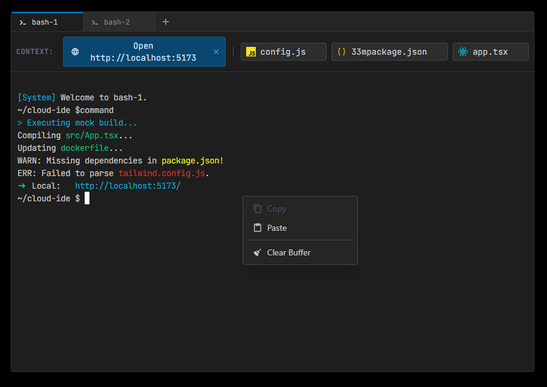
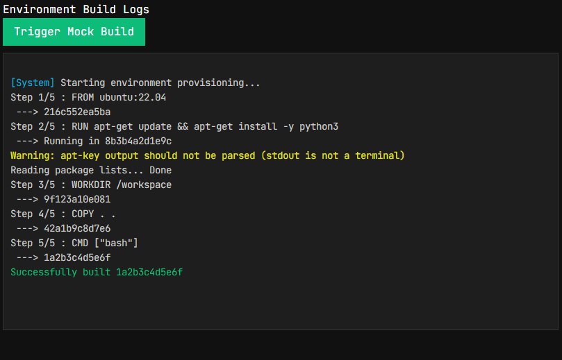

# ☁️ Cloud IDE: Terminal Architecture & Implementation Guide

## Overview
This module provides a highly decoupled, **GPU-accelerated**, and multiplexed terminal interface powered by `xterm.js`. It is built using the **Ports and Adapters (Hexagonal)** architectural pattern, strictly separating UI rendering from backend execution environments (WebSocket PTYs, Docker logs).

This design solves common browser-based IDE challenges: **WebGL context loss**, **flexbox boundary collapses**, **canvas-based focus stealing**, and **UI thread blocking**.

## Directory Structure
```plaintext
terminal/
├── components/           # The "Dumb" UI Presentation Layer
│   ├── Terminal.tsx
│   ├── TerminalContextMenu.tsx
│   ├── TerminalContextWidget.tsx
│   ├── TerminalPanel.tsx
│   ├── TerminalSearchWidget.tsx
│   ├── TerminalTabs.tsx
│   └── theme.ts
├── core/                 # The Event Kernel & Data Processing
│   ├── middlewares/      # Intercepts/mutates raw string streams
│   │   ├── CommandSnifferMiddleware.ts
│   │   └── WindowsClearFix.ts
│   ├── plugins/          # Background tasks acting on terminal events
│   │   ├── FileIconPlugin.ts
│   │   ├── LinkSnifferPluggin.ts
│   │   └── RepoGraphPlugin.ts
│   ├── InputManager.ts   # PTY key translation & Clipboard handling
│   ├── MiddlewarePipeline.ts
│   └── TerminalEventBus.ts # The isolated Pub/Sub nervous system
├── dev/
│   └── IdeWorkspaceTest.tsx
├── hooks/
│   └── useTerminal.ts    # Core xterm.js instance & WebGL wrapper
├── providers/
│   └── IdeLinkProvider.ts# Parses raw text into clickable elements
├── transport/            # The Infrastructure Layer (Network APIs)
│   ├── DockerStream.ts
│   ├── SessionStream.ts
│   └── WebSocketTransport.ts
├── types/
│   ├── terminal.d.ts
│   └── index.ts
└── README.md
```
---

### 1. The Presentation Layer (`/components`)

*   **`useTerminal.ts`**: The low-level wrapper around the `xterm.js` class. Manages the **WebGL context**, instantiates addons (**Fit, Search, WebLinks**), and uses a `ResizeObserver` to mathematically enforce perfect canvas dimensions.
*   **`Terminal.tsx`**: The React boundary. Exposes safe imperative methods (`write`, `clear`, `getSelection`) via `TerminalHandle`. Sets up the `MiddlewarePipeline` and local DOM event listeners (like intercepting custom pastes).
*   **`TerminalPanel.tsx`**: The **Isolation Sandbox**. Bundles a single terminal canvas with a private `TerminalEventBus`. Stacks in the DOM using `position: absolute` and `visibility: hidden` to prevent background WebGL canvases from collapsing when inactive.
*   **`TerminalTabs.tsx`**: The **Session Multiplexer**. Renders the tab bar and simultaneously mounts all active `TerminalPanel` components, controlling their visibility state.
*   **`TerminalContextMenu.tsx`**: The **Canvas Clipboard Manager**. Uses a "Snapshot Strategy" to capture highlighted text before the menu opens, and "Focus Protection" (`e.preventDefault()`) to prevent `xterm.js` from erasing the selection.
*   **`TerminalContextWidget.tsx` & `TerminalSearchWidget.tsx`**: Decoupled, floating HUDs that react exclusively to `TerminalEventBus` signals.

---

### 2. The Infrastructure Layer (`/transport`)

The UI components never speak directly to a WebSocket or an API. They only communicate via the `ITransportStream` interface.

*   **`WebSocketTransport.ts`**: The production workhorse. Connects to the `execd` PTY daemon inside the isolated container. Handles **binary ArrayBuffer conversion**, exponential backoff reconnection, and sending JSON control payloads (like window resizing commands).
*   **`DockerStream.ts` / `SessionStream.ts`**: Alternate transport implementations. For example, `DockerStream` might be a read-only transport used purely for tailing build logs from the environment manager.

### 3. The Protocol Layer (`/core/middlewares`)
Sits directly between the **Transport** and the **Screen**. It sanitizes data moving in both directions.

* **`MiddlewarePipeline.ts`**: The orchestrator. Loops through registered middlewares applying `processIncoming` (Backend -> Screen) and `processOutgoing` (Keyboard -> Backend).
* **`WindowsClearFix.ts`**: A standard pipeline sanitizer that intercepts broken `\r\n` carriage returns or specific clear-screen ANSI codes from different OS backends and normalizes them for the browser canvas.
* **`CommandSnifferMiddleware.ts`**: Intercepts outgoing keystrokes. When it detects an **Enter** key (`\r`), it broadcasts the assembled command string over the **Event Bus** for plugins to consume.

### 4. The Event Kernel & Plugins (`/core/plugins`)
The core architectural principle of this terminal is **Zero UI Blocking**. Feature logic runs in decoupled plugins.

* **`TerminalEventBus.ts`**: A strictly typed Pub/Sub system. Every terminal tab gets its own isolated bus.
* **`FileIconPlugin.ts` & `LinkSnifferPluggin.ts`**: Listen to data streams, apply regex patterns to detect paths or URLs, and emit `UI_CONTEXT_SUGGESTED` events to populate the Context HUD.
* **`RepoGraphPlugin.ts`**: An agentic tracking plugin. Listens to executed commands via the `CommandSnifferMiddleware` to dynamically update a localized knowledge graph of the user's repository state, providing contextual memory for AI assistants.

### 5. Input & Link Management
* **`InputManager.ts`**: Translates browser DOM events into Linux PTY standards. For example, translating a "Copy" command, translating `SIGINT` (Ctrl+C) into `\x03`, and managing asynchronous `navigator.clipboard` requests safely.
* **`IdeLinkProvider.ts`**: Hooks into the core `xterm.js` rendering engine. It highlights recognizable text patterns (like `http://localhost:5173`) and fires events to the bus when the user physically clicks the canvas.

## Implementation Guide: Building Workspace.tsx

When migrating from the Dev Harness to the production IDE Workspace, use this boilerplate to dynamically instantiate real `WebSocketTransport` connections and handle Cloud IDE URL proxying.

### Architectural Note: URL Proxying
When a user runs a dev server (like Vite or React) inside their container, the terminal outputs `http://localhost:5173`. However, localhost inside a Docker container is not accessible to the user's browser. The Workspace component intercepts these clicks, extracts the port, and rewrites the URL to route through the Cloud IDE's proxy domain (e.g., `https://5173-[sandbox-id].your-cloud-ide.com`).

```typescript
import React, { useState, useEffect, useRef, useMemo } from 'react';
import { TerminalTabs, TerminalSession } from '@frontend/terminal/components/TerminalTabs';
import { WebSocketTransport } from '@frontend/terminal/transport/WebSocketTransport';
import { TerminalEventBus } from '@frontend/terminal/core/TerminalEventBus';
import { FileIconPlugin } from '@frontend/terminal/core/plugins/FileIconPlugin';
import { LinkSnifferPlugin } from '@frontend/terminal/core/plugins/LinkSnifferPlugin';

interface IdeWorkspaceProps {
  sandboxId: string; // The unique ID of the container environment
}

export const ProductionWorkspace = ({ sandboxId }: IdeWorkspaceProps) => {
  const [sessions, setSessions] = useState<TerminalSession[]>([]);

  /**
   * Provisions a new PTY daemon via the backend and connects the Transport.
   */
  const startNewTerminalSession = async () => {
    try {
      // 1. Request a new PTY session from the container orchestrator
      const response = await fetch('/api/v1/sandbox/terminal/spawn', { method: 'POST' });
      const { port, sessionId } = await response.json();

      // 2. Initialize the production WebSocket transport
      const wsUrl = `wss://://yourdomain.com{sessionId}?port=${port}`;
      const transport = new WebSocketTransport(wsUrl);

      // 3. Register the session in state
      const newSession: TerminalSession = {
        id: sessionId,
        title: `bash-${sessions.length + 1}`,
        transport: transport
      };

      setSessions(prev => [...prev, newSession]);

      // 4. Connect the socket
      await transport.connect();

    } catch (error) {
      console.error("Failed to spawn terminal process", error);
    }
  };

  /**
   * Safely kills the backend process and removes the UI tab.
   */
  const handleCloseTab = (idToClose: string) => {
    setSessions(prev => {
      const session = prev.find(s => s.id === idToClose);
      if (session) {
        // Disconnecting the WebSocket sends a SIGTERM to the backend PTY
        session.transport.disconnect(); 
      }
      return prev.filter(s => s.id !== idToClose);
    });
  };

  /**
   * Action handlers for the floating Context HUD.
   */
  const handleFileClick = (fileName: string) => {
    // Dispatch to global IDE state (e.g., Redux or Zustand) to open the Editor tab
    // dispatch(openFileTab(fileName));
    console.log(`[IDE Action] User clicked ${fileName}. Opening in code editor.`);
  };

  /**
   * Intercepts "localhost" links and proxies them through the Cloud IDE router.
   */
  const handleLinkClick = (rawUrl: string) => {
    // 1. Extract the port from the raw URL (e.g., "http://localhost:5173" -> "5173")
    const portMatch = rawUrl.match(/:(\d{2,5})/);
    if (!portMatch) return;
    const port = portMatch[1];

    // 2. Build the proxy URL based on the backend OpenSandbox architecture
    const proxiedUrl = `https://${port}-${sandboxId}.your-cloud-ide.com`;

    console.log(`[IDE Action] Intercepted ${rawUrl}. Opening split pane for ${proxiedUrl}`);
    
    // 3. Dispatch action to open the built-in browser/preview tab in the IDE
    // dispatch(openPreviewTab(proxiedUrl));
  };

  return (
    <div className="w-full h-full bg-[#1e1e1e] flex flex-col">
      {/* The TerminalTabs component handles all internal multiplexing, 
        WebGL canvas retention, and Plugin instantiation natively.
      */}
      <TerminalTabs 
        initialSessions={sessions}
        onAddTab={startNewTerminalSession}
        onCloseTab={handleCloseTab}
        onFileClick={handleFileClick}
        onLinkClick={handleLinkClick}
      />
    </div>
  );
};
```

# For observation purposes, our current terminal looks like this:



# We also have an example of a readonly terminal to stream build logs e.g.

```typescript
// frontend/src/BuildLogViewer.tsx
import React, { useEffect, useRef } from 'react'; // Removed useMemo

import { TerminalComponent, TerminalHandle } from '@frontend/terminal/components/Terminal';

// Or whatever transport layer you decide to build
import { MockBuildTransport } from '@frontend/terminal/dev/MockBuildTransport';

export const BuildLogViewer = () => {
  const terminalRef = useRef<TerminalHandle>(null);
  
  // FIXED 2: Bind the class instance to a ref so React can never garbage-collect 
  // it while the component is mounted. We extract .current immediately for clean usage.
  const buildTransport = useRef(new MockBuildTransport()).current;

  useEffect(() => {
    // This is safe even in React 18 Strict Mode double-mounts, 
    // as long as your MockBuildTransport handles rapid disconnect/reconnects.
    buildTransport.connect();
    
    return () => buildTransport.disconnect();
  }, [buildTransport]);

  const handleStartBuild = () => {
    // Clear the screen before starting a new build
    terminalRef.current?.clear(); 
    buildTransport.startMockBuild();
  };

  return (
    <div style={{ padding: '20px', backgroundColor: '#111', color: 'white', height: '100vh' }}>
      <h2>Environment Build Logs</h2>
      
      <button 
        onClick={handleStartBuild}
        style={{ marginBottom: '10px', padding: '8px 16px', background: '#0dbc79', border: 'none', cursor: 'pointer' }}
      >
        Trigger Mock Build
      </button>

      {/* The dimensions here act as a hard boundary, which the xterm ResizeObserver 
          will detect and perfectly fit the terminal inside! */}
      <div style={{ height: '400px', width: '800px', border: '1px solid #333' }}>
        <TerminalComponent 
          ref={terminalRef}
          theme="dark"
          isReadOnly={true}              // Locks the keyboard
          transport={buildTransport}     // Streams the logs
        />
      </div>
    </div>
  );
};
```

to give us this:



